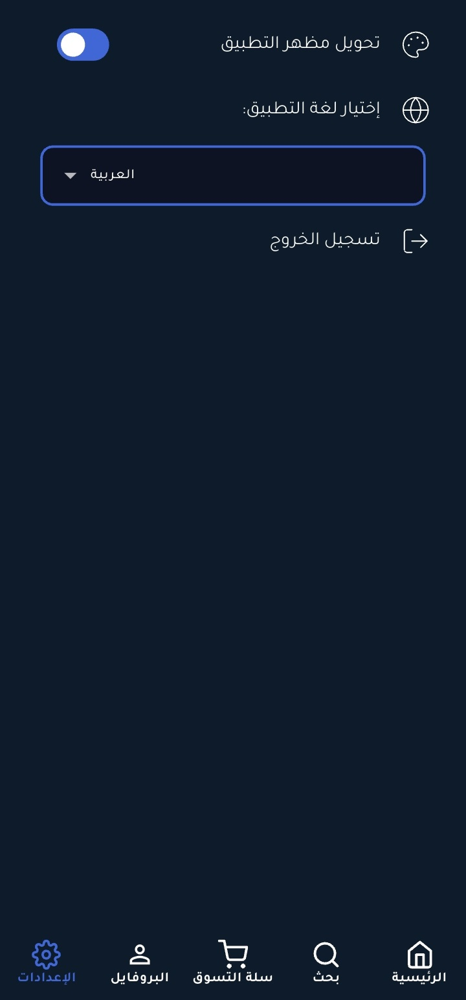

# E-Commerce App

## 📌 Project

**Stylish**  
is a Flutter e-commerce app (portfolio project) built with Flutter + Supabase. Clean UI for
browsing, filtering, and buying clothes.

---

## 📄 Description

This is an e-commerce app built using **Flutter**. The app provides a platform where users can
browse products, add them to their cart, and complete purchases. It features a smooth UI and
integrates features such as authentication, payment flows, and product management.

---

## 🖼 App Screenshots

<div align="center" style="display:flex; flex-direction:column; width:100%;">

  <!-- Onboarding Screens -->
  <div style="display:flex; justify-content:center; gap:1%; margin-bottom:8px;">
    
    
  </div>
  <p><b>OnBoarding</b><br>A smooth and interactive onboarding experience that guides users through the app’s main features.</p>

  <hr style="height:2px; background:#333; border:none;">

  <!-- Authentication Screens -->
  <div style="display:flex; justify-content:center; gap:1%; margin-bottom:8px;">
    
    
  </div>
  <p><b>Authentication</b><br>Simple, focused login UI with email/password fields and a clear way to sign in.</p>

  <hr style="height:2px; background:#333; border:none;">

  <!-- Home Screens -->
  <div style="display:flex; justify-content:center; gap:1%; margin-bottom:8px;">
    
    
  </div>
  <div style="display:flex; justify-content:center; gap:1%; margin-bottom:8px;">
    
    
  </div>
  <p><b>Home</b><br>Big promotional header that highlights deals, seasonal banners, or featured collections.</p>

  <hr style="height:2px; background:#333; border:none;">

  <!-- Shop Screens -->
  <div style="display:flex; justify-content:center; gap:1%; margin-bottom:8px;">
    
    
  </div>
  <p><b>Shop — Product Listing</b><br>Grid/list of products with thumbnails, short titles, and prices.</p>

  <hr style="height:2px; background:#333; border:none;">

  <!-- Product Details -->
  <div style="display:flex; justify-content:center; gap:1%; margin-bottom:8px;">
    
  </div>
  <p><b>Product Details</b><br>Full product page with images, specs, price, variants, and add-to-cart CTA.</p>

  <hr style="height:2px; background:#333; border:none;">

  <!-- Settings / Account -->
  <div style="display:flex; justify-content:center; gap:1%; margin-bottom:8px;">
    
  </div>
  <p><b>Settings / Account</b><br>User profile, preferences, theme options, and logout — all in one tidy settings screen.</p>

</div>

---

## ✨ Features

* User Authentication (Sign Up, Login, Logout, Forgot password)
* Product Listing and Search
* Filters (category, price, color, size)
* Cart and Checkout flows
* Blog / Inspiration pages (optional)

---

## 🛠 Technologies Used

* **Flutter**
* **Dart**
* **Supabase** (Auth & backend)
* **Shared Preferences** (local storage)

---

## 🚀 Installation

Clone the repository:

```bash
git clone https://gitlab.com/bilalgh2005@gmail.com/e_commerce.git
